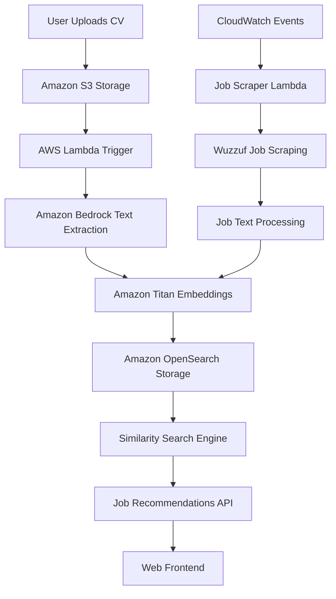

# AI-Powered Job Recommendation System 
**An intelligent job recommendation system that matches users with the most relevant job opportunities based on their CV using advanced AI and semantic search technology.**


---

## 🎯 Live Demo

### 🌐 **[Try the Live Demo](https://staging.d2ewthu976q3qk.amplifyapp.com/)** -- https://staging.d2ewthu976q3qk.amplifyapp.com/

### **Demo Video**
[](/Images/Live_Demo.webm)
<!-- Replace with actual video thumbnail and link -->

---

## Project Overview

This project is an intelligent job recommendation system that helps users find the most relevant job opportunities based solely on their CV content, without requiring manual input of skills or experience. The system uses advanced AI to understand both CVs and job descriptions, then provides personalized job matches.

### **Key Value Proposition**
- **Zero Manual Input**: Just upload your CV and get recommendations
- **AI-Powered Matching**: Uses Amazon Titan embeddings for semantic understanding
- **Real-Time Job Data**: Automatically scrapes and updates job listings
- **Intelligent Scoring**: Provides match percentages and similarity scores
- **Cloud-Native**: Built entirely on AWS for scalability and reliability


## Project Archticture


## Features

### Core Functionality
- **Modern Web Application**: Deployed on **AWS Amplify**, fully integrated with **GitHub CI/CD**. Every push to the main branch triggers automatic build and deployment, ensuring the site is always up-to-date.  
- **CV Upload**: Supports both **PDF** and **TXT** formats with secure storage in **Amazon S3** under structured user paths.  
- **AI Text Extraction**: Automatically extracts structured text from CVs using **Amazon Bedrock** (Claude / Titan Text models).  
- **Semantic Analysis**: Transforms CV text into **vector embeddings** with **Amazon Titan**, capturing deep semantic meaning for accurate job-to-CV comparisons.  
- **Smart Indexing**: Embeddings are stored and indexed in **Amazon OpenSearch**, enabling fast and precise **KNN similarity search**.  
- **Job Scraping**: Automated job listings collected from **Wuzzuf** using **AWS Lambda**, then converted into embeddings and indexed.  
- **Intelligent Matching**: Matches CV embeddings against job embeddings to deliver the **best-fit job recommendations**.  
- **Responsive Web UI**: Clean, modern interface for uploading CVs and viewing personalized job matches in real-time.  

### Technical Features
- **Serverless Architecture**: Fully event-driven design using **AWS Lambda**, reducing infrastructure overhead.  
- **Real-time Processing**: CV uploads instantly trigger the end-to-end pipeline — from text extraction to job matching.  
- **Scalable Storage**: **Amazon S3** handles CV storage, metadata, and processing artifacts at scale.  
- **Vector Search**: High-performance **semantic similarity search** with **Amazon OpenSearch Service**.  
- **Automated Updates**: Scheduled job scraping via **Amazon CloudWatch Events**, keeping job listings fresh and relevant.  
- **API Integration**: Exposes a **RESTful API**, allowing third-party applications to consume job recommendations.  

---

## System Architecture



###  **Technology Stack**

#### **Frontend**
- **HTML5/CSS3/JavaScript**: Modern responsive web interface

#### **Backend & AI**
- **AWS Lambda**: Serverless compute for CV processing and job scraping
- **Amazon Bedrock**: AI-powered text extraction from documents
- **Amazon Titan**: Advanced text embeddings for semantic understanding
- **Amazon OpenSearch**: Vector database for similarity search

#### **Storage & Data**
- **Amazon S3**: CV file storage and static website hosting
- **OpenSearch Indices**: Structured storage for CV and job embeddings
- **CloudWatch**: Monitoring, logging, and scheduled events

---


## Technical Implementation

### **Data Flow**

#### **CV Processing Pipeline**
```
S3 Upload → Lambda Trigger → Text Extraction → Embedding Generation → OpenSearch Storage
```

#### **Job Scraping Pipeline**
```
CloudWatch Event → Lambda Function → Web Scraping → Text Processing → Embedding → Storage
```

#### **Recommendation Engine**
```
User Request → CV Retrieval → Vector Search → Job Matching → Results
```

### **Database Schema**

#### **CV Index (`cv-index`)**
```json
{
  "user_id": "string",
  "cv_text": "string",
  "cv_embedding": [float],
  "skills_extracted": ["string"],
  "experience_years": number,
  "job_title": "string",
  "timestamp": number,
  "s3_bucket": "string",
  "s3_key": "string"
}
```

#### **Job Index (`job-index`)**
```json
{
  "job_id": "string",
  "title": "string",
  "company": "string", 
  "description": "string",
  "job_embedding": [float],
  "skills_required": ["string"],
  "experience_level": "string",
  "location": "string",
  "job_url": "string",
  "scraped_date": number
}
```

---

## API Documentation

###  **Get Job Recommendations**
```http
POST /recommendations
Content-Type: application/json

{
  "user_id": "user123"
}
```

**Response:**
```json
{
  "user_id": "user123",
  "total_recommendations": 10,
  "user_profile": {
    "skills_extracted": ["Python", "AWS", "Machine Learning"],
    "experience_years": 5,
    "job_title": "Software Engineer"
  },
  "recommendations": [
    {
      "job_id": "abc123",
      "title": "Senior Python Developer",
      "company": "Tech Corp",
      "description": "Looking for experienced Python developer...",
      "match_percentage": 95,
      "similarity_score": 0.89,
      "skills_required": ["Python", "Django", "AWS"],
      "location": "Cairo, Egypt"
    }
  ]
}
```

### **Search Jobs**
```http
POST /search
Content-Type: application/json

{
  "query": {
    "match": {
      "title": "software engineer"
    }
  },
  "size": 20
}
```

### **System Status**
```http
GET /status
```

---

## Local Development

### **Setup Development Environment**

1. **Install Dependencies**
   ```bash
   pip install -r requirements.txt
   ```

2. **Configure AWS Credentials**
   ```bash
   aws configure
   # Enter your AWS Access Key ID, Secret Key, and Region
   ```

3. **Set Environment Variables**
   ```bash
   export OPENSEARCH_ENDPOINT="your-opensearch-domain-endpoint"
   export CV_BUCKET="cv-uploads-website-bucket"
   export TEXT_BUCKET="extracted-cv-text-bucket"
   ```

4. **Run Local Tests**
   ```bash
   python test_local.py
   ```

### **Testing Components**

#### **Test CV Processing**
```python
from cv_processor import CVProcessor
processor = CVProcessor()
result = processor.test_processing()
print(result)
```

#### **Test Job Scraping**
```python
from job_scraper import JobScraper
scraper = JobScraper()
result = scraper.scrape_small_batch(max_jobs=5)
print(result)
```

#### **Test Embeddings**
```python
from embedding_service import EmbeddingService
service = EmbeddingService()
embedding = service.generate_embedding("Software engineer with Python experience")
print(f"Generated embedding with {len(embedding)} dimensions")
```

---

## Performance Metrics

### **System Performance**
- **CV Processing Time**: ~3-5 seconds per CV
- **Job Scraping Rate**: ~50-100 jobs each 6 hours
- **Recommendation Generation**: <1 second
- **Embedding Dimensions**: 1024 (Titan v2)
- **Search Response Time**: <500ms for similarity queries

### **Scalability**
- **Concurrent Users**: Supports 100+ simultaneous users
- **CV Storage**: Unlimited (S3-based)
- **Job Database**: 10,000+ jobs with auto-refresh
- **Daily Job Updates**: Automated scraping every 6 hours

---

## Security & Privacy

### **Data Protection**
- **CV Encryption**: All CVs encrypted at rest in S3
- **Access Control**: IAM-based permissions for all services
- **Network Security**: VPC isolation for OpenSearch domain
- **API Security**: CORS-enabled endpoints with proper headers

### **Privacy Features**
- **Anonymous Processing**: No personal data required beyond CV content
- **Data Retention**: Configurable CV retention policies
- **Opt-out Options**: Users can request data deletion
- **Compliance**: GDPR-ready data handling practices

---

##  Cost Optimization

###  **Estimated Monthly Costs (1000 users)**
- **S3 Storage**: $2-5 (CV files)
- **Lambda Execution**: $5-10 (processing)
- **Amazon Bedrock**: $10-20 (text extraction)
- **Amazon Titan**: $15-30 (embeddings)
- **OpenSearch**: $50-100 (depending on instance type)
- **Data Transfer**: $1-3
- **Total**: **$83-168/month**

###  **Cost Optimization Tips**
- Use S3 Intelligent Tiering for CV storage
- Optimize Lambda memory allocation
- Use OpenSearch reserved instances for production
- Implement caching for frequent job searches

---

## Deployment Guide

###  **Production Deployment**

#### **Step 1: Infrastructure Setup**
```bash
# Create production S3 buckets
aws s3 mb s3://prod-cv-uploads-bucket
aws s3 mb s3://prod-cv-text-bucket

# Create OpenSearch domain
aws opensearch create-domain \
  --domain-name prod-job-recommendation-domain \
  --elasticsearch-version OpenSearch_2.5 \
  --elasticsearch-cluster-config InstanceType=t3.small.search,InstanceCount=1
```

#### **Step 2: Lambda Deployment**
```bash
# Package and deploy Lambda function
zip -r lambda-deployment.zip .
aws lambda create-function \
  --function-name cv-job-embedding-processor \
  --runtime python3.9 \
  --role arn:aws:iam::ACCOUNT:role/cv-job-embedding-lambda-role \
  --handler lambda_function.lambda_handler \
  --zip-file fileb://lambda-deployment.zip \
  --timeout 900 \
  --memory-size 1024
```

#### **Step 3: Configure Triggers**
```bash
# S3 bucket notification
aws s3api put-bucket-notification-configuration \
  --bucket prod-cv-uploads-bucket \
  --notification-configuration file://s3-notification.json

# CloudWatch Events for job scraping
aws events put-rule \
  --name job-scraping-schedule \
  --schedule-expression "rate(6 hours)"
```

### **Website Deployment**
```bash
# Enable static website hosting
aws s3 website s3://prod-cv-uploads-bucket \
  --index-document index.html \
  --error-document error.html

# Upload website files
aws s3 sync ./frontend s3://prod-cv-uploads-bucket \
  --exclude="*.DS_Store" \
  --acl public-read
```

---

## Monitoring & Analytics

###  **CloudWatch Dashboards**
- **System Health**: Lambda execution metrics, error rates
- **User Activity**: CV uploads, recommendation requests
- **Job Database**: Scraping success rates, job counts
- **Performance**: Response times, embedding generation speed

###  **Alerting Setup**
- Lambda function errors
- OpenSearch cluster health
- Unusual job scraping failures
- High API response times
---

## Configuration

### **Environment Variables**
```bash
# Required Environment Variables
OPENSEARCH_ENDPOINT=search-domain.region.es.amazonaws.com
OPENSEARCH_DOMAIN_NAME=cv-job-recommendation-domain
CV_BUCKET=cv-uploads-website-bucket
TEXT_BUCKET=extracted-cv-text-bucket
APP_REGION=us-east-1
EMBEDDING_MODEL=amazon.titan-embed-text-v2
```

---

## How It Works

### **AI Processing Pipeline**

#### **1. CV Analysis**
- Extract text from uploaded PDF/TXT files
- Parse skills, experience, and job titles
- Generate 1024-dimensional embedding vectors
- Store structured data in OpenSearch

#### **2. Job Intelligence**
- Scrape job listings from Wuzzuf (Egypt's leading job portal)
- Extract key information: title, company, description, requirements
- Generate embeddings for each job description
- Update database with fresh job opportunities

#### **3. Matching Algorithm**
- Calculate cosine similarity between CV and job embeddings
- Apply filters for location, experience level, and skills
- Rank results by relevance score
- Return top N recommendations with match percentages

### **Matching Accuracy**
- **Semantic Understanding**: Goes beyond keyword matching
- **Context Awareness**: Understands related skills and technologies
- **Experience Mapping**: Matches seniority levels appropriately
- **Continuous Learning**: Improves with more data over time

---

##  Troubleshooting

### **Common Issues**

#### **CV Upload Problems**
```bash
# Check S3 bucket permissions
aws s3api get-bucket-acl --bucket cv-uploads-website-bucket

# Verify Lambda trigger
aws lambda get-event-source-mapping --uuid YOUR_MAPPING_UUID
```

#### **No Job Recommendations**
```bash
# Check OpenSearch indices
curl -X GET "https://search-cv-job-recommendation-domain-mvzfnkzlavodplsn4nf2zixsfi.us-east-1.es.amazonaws.com/cv_index"

# Verify embeddings exist
curl -X GET "https://search-cv-job-recommendation-domain-mvzfnkzlavodplsn4nf2zixsfi.us-east-1.es.amazonaws.com/cv_index/_search" \
  -H "Content-Type: application/json" \
  -d '{"query": {"exists": {"field": "cv_embedding"}}}'
```

#### **Embedding Generation Failures**
```bash
# Test Bedrock access
aws bedrock-runtime invoke-model \
  --model-id amazon.titan-embed-text-v2:0 \
  --body '{"inputText":"test"}' \
  output.json
```
---

## Author

**[Your Name]**
- GitHub: [@yourusername](https://github.com/yourusername)
- LinkedIn: [Your LinkedIn](https://linkedin.com/in/yourprofile)
- Email: your.email@example.com

---

## Acknowledgments

- **Amazon Web Services** for providing the cloud infrastructure
- **Wuzzuf.net** for job listing data source
- **OpenSearch Community** for the powerful search engine
- **Beautiful Soup** for web scraping capabilities

---
